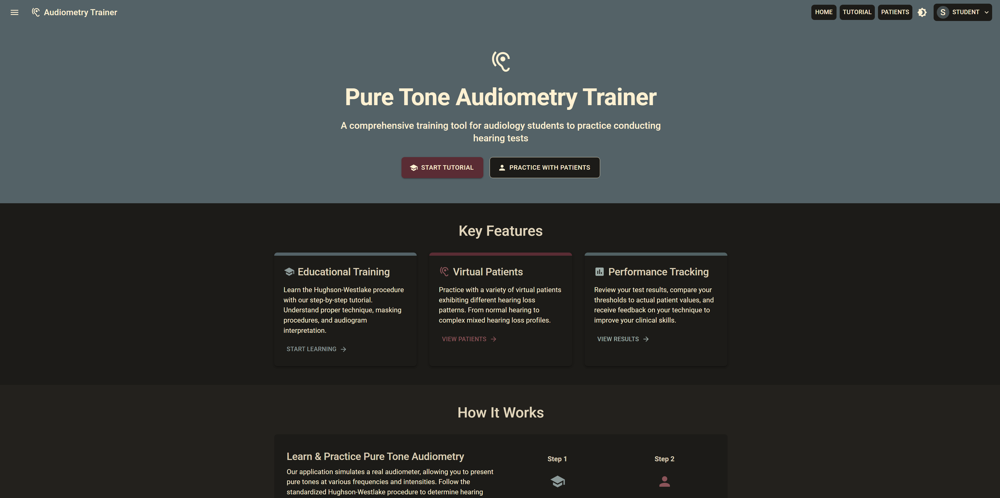

# Audiometry Trainer

A professional web application for Pure Tone Audiometry Training designed for audiology students and professionals. This application provides a simulation of standard audiology procedures, with a focus on the Hughson-Westlake procedure, allowing students to practice and master audiometric testing techniques.



## Project Overview

The Audiometry Trainer is a comprehensive React-based application that simulates various audiology procedures including:

- Pure Tone Audiometry with Hughson-Westlake procedure
- Real Ear Measurement (REM)
- Contour Test
- Otoscopy examination
- 3D Ear Anatomy exploration

The application is designed to be educational, providing interactive simulations, tutorials, and feedback to help users learn and practice audiology techniques.

## Features

- **Interactive Audiogram**: Visualize and plot hearing thresholds across different frequencies
- **Virtual Patient System**: Practice with simulated patients having various hearing profiles
- **Hughson-Westlake Procedure**: Learn and apply the standard "5-up, 10-down" testing protocol
- **Real Ear Measurement (REM)**: Simulate fitting hearing aids using real ear measurement techniques
- **3D Ear Anatomy**: Interactive 3D model of ear anatomy for educational purposes
- **Otoscopy Simulation**: Practice otoscopy examination techniques
- **Contour Test**: Perform speech audiometry contour testing
- **Educational Feedback**: Receive guidance and performance assessment after each test
- **Keyboard Shortcuts**: Efficient testing with keyboard controls
- **Progress Tracking**: Monitor improvement over time
- **Responsive Design**: Works on desktop, tablet, and mobile devices
- **Accessibility Features**: High contrast mode and screen reader support

## Project Structure

The application follows a component-based architecture with the following structure:

```
src/
├── assets/           # Images, sounds, and other static files
├── components/       # Reusable UI components (Audiogram, TestingInterface, etc.)
├── constants/        # Application-wide constants and configuration
├── interfaces/       # TypeScript type definitions for the application
├── pages/            # Main application views (HomePage, TutorialPage, etc.)
├── services/         # Business logic and data handling (AudioService, TestingService, etc.)
├── types/            # Additional type definitions
└── App.tsx           # Main application component
```

### Key Components

- **TestingInterface**: Core component for audiometric testing, implements the Hughson-Westlake procedure
- **Audiogram**: Visual representation of hearing thresholds across frequencies
- **EarModel3D**: Three.js-based 3D model of ear anatomy
- **RealEarMeasurementPage**: Simulation of real ear measurement procedures
- **OtoscopyPage**: Interactive otoscopy simulation
- **ContourTestPage**: Implementation of speech audiometry contour testing

### Core Services

- **AudioService**: Handles generation of pure tones using Web Audio API
- **TestingService**: Implements the Hughson-Westlake procedure and testing logic
- **PatientService**: Manages virtual patient profiles and hearing data
- **RealEarMeasurementService**: Handles the simulation of real ear measurements
- **ContourTestService**: Implements contour test functionality

## Technical Details

### Built With

- **React 19.0.0**: Modern frontend framework for building the UI
- **TypeScript 4.9.5**: Type-safe JavaScript for more robust code
- **Material UI 6.4.6**: UI component library for a professional look and feel
- **React Three Fiber 9.1.0**: React renderer for Three.js to create 3D visualizations
- **Chart.js 4.4.8**: Charting library used for the audiogram and data visualization
- **React Router 7.2.0**: For handling navigation and routing within the application
- **Web Audio API**: Browser API used for generating calibrated audio tones

### Key Features Implementation

#### Audio Generation
The application uses the Web Audio API through the `AudioService` to generate pure tones at specific frequencies and intensities. The service includes calibration settings to simulate real audiometric equipment.

#### Testing Procedures
The `TestingService` implements the Hughson-Westlake procedure (5-up, 10-down method) used in standard audiometric testing. It tracks user responses and determines hearing thresholds based on the testing protocol.

#### Virtual Patients
Virtual patients with different hearing profiles are defined in the `PatientService`. Each patient has specific thresholds at different frequencies, simulating various types of hearing loss (conductive, sensorineural, mixed, etc.).

#### Interactive Visualizations
The application provides interactive visualizations including:
- 2D audiograms for plotting hearing thresholds
- 3D ear anatomy model for educational purposes
- Real-ear measurement charts
- Otoscopy visualizations

#### Data Storage
The application uses browser local storage to save:
- User settings and preferences
- Test results and progress
- Recently used virtual patients

## Getting Started

### Prerequisites

- Node.js (v16.0.0 or higher)
- npm (v8.0.0 or higher)

### Installation

1. Clone the repository:
   ```
   git clone https://github.com/sk408/audiometry_trainer.git
   cd audiometry_trainer
   ```

2. Install dependencies:
   ```
   npm install
   ```

3. Start the development server:
   ```
   npm start
   ```

4. Open your browser and navigate to:
   ```
   http://localhost:3000
   ```

## Usage Guide

### Tutorial Mode
Start with the tutorial to learn the basics of pure tone audiometry and the Hughson-Westlake procedure. The tutorial provides step-by-step instructions and interactive examples.

### Practice Modes

#### Pure Tone Audiometry
Select a virtual patient from the patients page to begin practicing standard audiometry. Each patient has a unique hearing profile that simulates different types of hearing loss. Follow the Hughson-Westlake procedure to determine the patient's hearing thresholds.

#### Real Ear Measurement
Practice fitting hearing aids using real ear measurement techniques. The simulation provides various test signals and target gain values to match.

#### Otoscopy
Examine virtual patients' ear canals and tympanic membranes using the simulated otoscope.

#### 3D Ear Anatomy
Explore the detailed 3D model of the ear to learn about its anatomical structures and functions.

#### Contour Test
Perform speech audiometry using the contour test method to assess patients' speech recognition thresholds.

### Keyboard Shortcuts

- **Space**: Present tone
- **Up/Down Arrows**: Adjust intensity
- **Left/Right Arrows**: Change frequency
- **R**: Switch to right ear
- **L**: Switch to left ear
- **M**: Toggle masking
- **Enter**: Record threshold

## For AI Assistants

This section provides key information to help AI assistants understand and interact with this codebase:

### Key Concepts in Audiology
- **Pure Tone Audiometry**: Testing hearing using pure tones at various frequencies and intensities
- **Hughson-Westlake Procedure**: A standardized method for determining hearing thresholds (5-up, 10-down protocol)
- **Audiogram**: A visual representation of hearing thresholds across different frequencies
- **Masking**: Technique to prevent crossover hearing during testing
- **Real Ear Measurement**: A technique for verifying hearing aid performance in the ear canal
- **Otoscopy**: Examination of the ear canal and tympanic membrane
- **Contour Test**: Speech audiometry test to determine speech recognition thresholds

### Data Structures
The application uses TypeScript interfaces to define its data structures:
- `HearingProfile`: Represents a virtual patient with specific hearing thresholds
- `ThresholdPoint`: A single point on the audiogram representing a specific hearing threshold
- `TestSession`: A testing session tracking the user's progress through the procedure
- `TestResult`: The outcome of a testing session including accuracy metrics

### Application Flow
1. User selects a virtual patient or procedure from the home screen
2. The application loads the appropriate testing interface
3. User performs the testing procedure following the onscreen guidance
4. The application tracks user actions and provides feedback
5. Results are displayed and stored after completion

## License

This project is licensed under the Custom Open Source License - see the [LICENSE](./LICENSE) file for details. The license allows for open-source use, modification, and distribution while the original author retains all commercial rights.

## Acknowledgments

- American Speech-Language-Hearing Association (ASHA) for audiometry guidelines
- British Society of Audiology for recommended procedures
- Audiology educators and students who provided feedback during development
